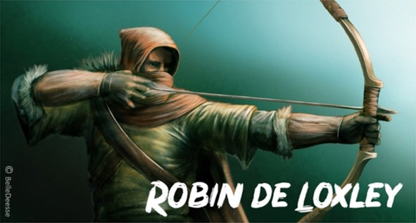

# AoE2_RobinDeLoxley
Campagne de Age of Empires 2: Definitive Edition dédiée à Robin de Loxley, le légendaire **Robin des bois**. L'histoire de la campagne est librement inspirée des adaptations de Robin des Bois au cinéma mais vise à respecter le plus fidèlement possible les personnages et le contexte historique.

---

## Campagne

La campagne se compose de 6 scenarii:
 1) L'embuscade (Jérusalem)
 2) Périple en haute-mer (mer Méditerrannée, entre Chypre et Gibraltar)
 3) Retour à Nottingham (côte est et ouest du Royaume-Uni)
 4) Le Major Oak (forêt de Sherwood et ses environs)
 5) La flamme de la révolte (forêt de Sherwood et Nottingham)
 6) L'attaque de Nottingham (forêt de Sherwood et Nottingham)

## Personnages principaux

 * Robin de Loxley
 * Marianne
 * Petit-Jean
 * Frère Tuck
 * Robert de Rainault (nom choisi pour le shérif de Nottingham)
 * Richard Coeur de Lion
